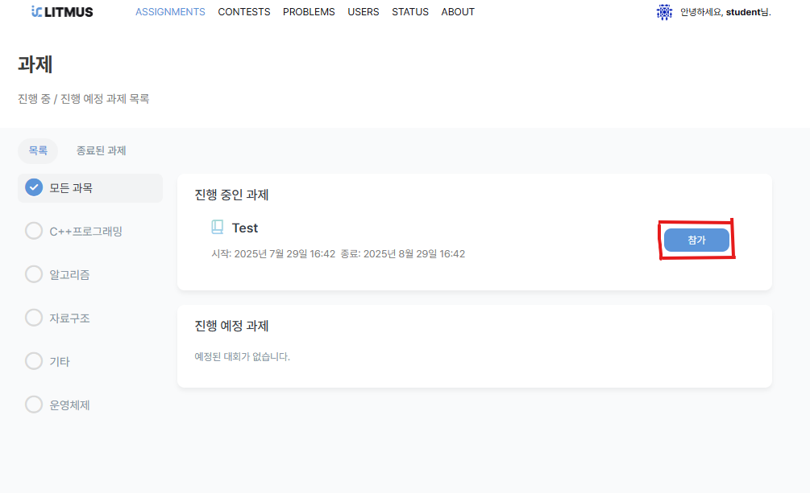
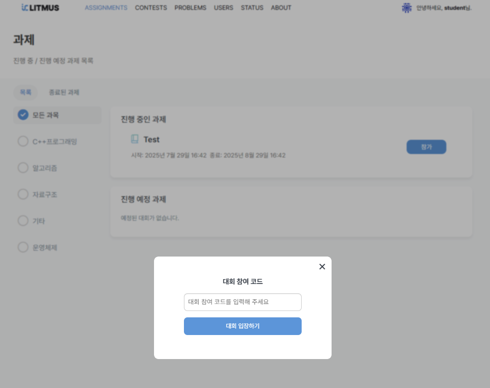
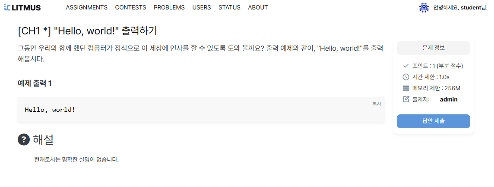
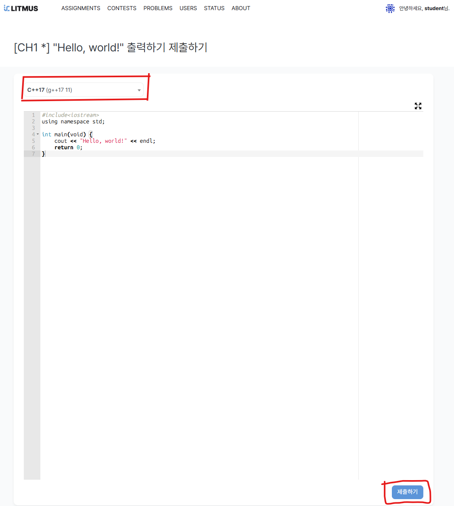
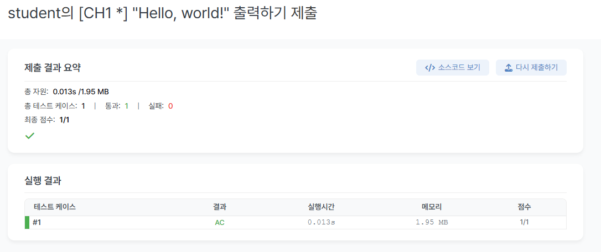

## 1. 수업 참가 방법

- 교수님으로부터 받은 참가 코드를 입력하여 수업에 가입합니다.

## 2. 문제 제출 방법

- 답안 제출을 클릭합니다.

- 제출하길 희망하는 언어를 선택합니다
 - 지원하는 언어는 C/C++, Java, Python 입니다.
- 코드를 작성하고 제출하기 버튼을 클락합니다.

- 답안을 제출 시 실행 결과가 표시됩니다.
  - 실패 시 소스코드 보기를 통해 제출 한 코드를 다시 확인 할 수 있습니다.
  - 다시 제출하기를 통해 재재첨을 합니다.

